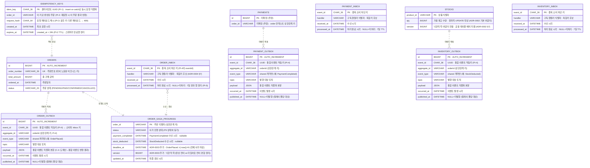

# ERD

```mermaid
erDiagram
    %% ---------- order_schema ----------
    ORDERS ||..o{ ORDER_OUTBOX : "이벤트 적재"
    ORDERS ||..|| ORDER_SAGA_PROGRESS : "진행도 추적"
    IDEMPOTENCY_KEYS }o..|| ORDERS : "멱등 생성"
    ORDER_INBOX }o..|| ORDER_SAGA_PROGRESS : "수신→갱신"

    ORDERS {
        id BIGINT "PK · AUTO_INCREMENT"
        order_number VARCHAR_36 "UK · 주문번호 (대외 노출용 비즈니스 키)"
        total_amount BIGINT "총 구매 금액"
        ordered_at DATETIME "주문일자"
        status VARCHAR_20 "주문 상태 (PENDING/PAID/CONFIRMED/CANCELLED)"
    }
    ORDER_SAGA_PROGRESS {
        order_id VARCHAR "PK · 주문 식별자 (상관관계 키)"
        status VARCHAR "사가 진행 상태 (PS 상태와 동기)"
        payment_completed DATETIME "PaymentCompleted 수신 시각 · nullable"
        stock_deducted DATETIME "StockDeducted 수신 시각 · nullable"
        deadline_at DATETIME "ADR-0003 추가 · OrderPlaced 시 now()+N (전체 사가 마감)"
        version BIGINT "ADR-0003 추가 · 낙관적 락 (정상 전이 vs 타임아웃 전이 경합 정리)"
        updated_at DATETIME "최종 갱신 시각"
    }
    IDEMPOTENCY_KEYS {
        idem_key CHAR_36 "PK · 클라이언트 UUID (PI-1) · insert-or-catch로 동시 요청 직렬화"
        order_id VARCHAR "이 키로 생성된 주문 (PI-2: 재요청 시 이 주문 결과 반환)"
        request_hash CHAR_64 "요청 페이로드 해시 (PI-3: 같은 키·다른 페이로드 → 409)"
        created_at DATETIME "최초 요청 시각"
        expires_at DATETIME "created_at + 24h (PI-2 TTL) · 스위퍼가 만료행 정리"
    }
    ORDER_OUTBOX {
        id BIGINT "PK · AUTO_INCREMENT"
        event_id CHAR_36 "UUID · 통합 이벤트 멱등키 (PI-4) → 소비자 Inbox 키"
        aggregate_id VARCHAR "orderId (상관관계 키, PI-4)"
        event_type VARCHAR "shared 계약명 (예: OrderPlaced)"
        topic VARCHAR "발행 대상 토픽"
        payload JSON "통합 이벤트 직렬화 본문 (C-4: 도메인→통합 이벤트 변환 결과)"
        occurred_at DATETIME "이벤트 발생 시각"
        published_at DATETIME "NULL=미발행 (릴레이 폴링 대상)"
    }
    ORDER_INBOX {
        event_id CHAR_36 "PK · 중복 소비 차단 키 (PI-4의 eventId)"
        handler VARCHAR "구독 핸들러 식별자 · 복합키 후보 (ADR-0004 §7)"
        received_at DATETIME "수신 시각"
        processed_at DATETIME "처리 완료 시각 · NULL=미처리 · 7일 경과 행 정리 (PI-5)"
    }

    %% ---------- payment_schema ----------
    PAYMENTS ||..o{ PAYMENT_OUTBOX : "이벤트 적재"
    PAYMENTS {
        id BIGINT "PK · 미확정 (추정)"
        order_id VARCHAR "미확정 (추정) · order 컨텍스트 상관관계 키"
    }
    PAYMENT_OUTBOX {
        id BIGINT "PK · AUTO_INCREMENT"
        event_id CHAR_36 "UUID · 통합 이벤트 멱등키 (PI-4)"
        aggregate_id VARCHAR "orderId (상관관계 키)"
        event_type VARCHAR "shared 계약명 (예: PaymentCompleted)"
        topic VARCHAR "발행 대상 토픽"
        payload JSON "통합 이벤트 직렬화 본문"
        occurred_at DATETIME "이벤트 발생 시각"
        published_at DATETIME "NULL=미발행 (릴레이 폴링 대상)"
    }
    PAYMENT_INBOX {
        event_id CHAR_36 "PK · 중복 소비 차단 키"
        handler VARCHAR "구독 핸들러 식별자 · 복합키 후보"
        received_at DATETIME "수신 시각"
        processed_at DATETIME "처리 완료 시각 · NULL=미처리 · 7일 TTL"
    }

    %% ---------- inventory_schema ----------
    STOCKS ||..o{ INVENTORY_OUTBOX : "이벤트 적재"
    STOCKS {
        product_id VARCHAR "PK · 상품 식별자"
        qty BIGINT "가용 재고 수량 · 원자적 UPDATE 대상 (ADR-0002 기본 어댑터)"
        version BIGINT "낙관적 락 어댑터 전용 · 공용 테이블 배치 미결 (ADR-0002 §7)"
    }
    INVENTORY_OUTBOX {
        id BIGINT "PK · AUTO_INCREMENT"
        event_id CHAR_36 "UUID · 통합 이벤트 멱등키 (PI-4)"
        aggregate_id VARCHAR "orderId (상관관계 키)"
        event_type VARCHAR "shared 계약명 (예: StockDeducted)"
        topic VARCHAR "발행 대상 토픽"
        payload JSON "통합 이벤트 직렬화 본문"
        occurred_at DATETIME "이벤트 발생 시각"
        published_at DATETIME "NULL=미발행 (릴레이 폴링 대상)"
    }
    INVENTORY_INBOX {
        event_id CHAR_36 "PK · 중복 소비 차단 키"
        handler VARCHAR "구독 핸들러 식별자 · 복합키 후보"
        received_at DATETIME "수신 시각"
        processed_at DATETIME "처리 완료 시각 · NULL=미처리 · 7일 TTL"
    }
```