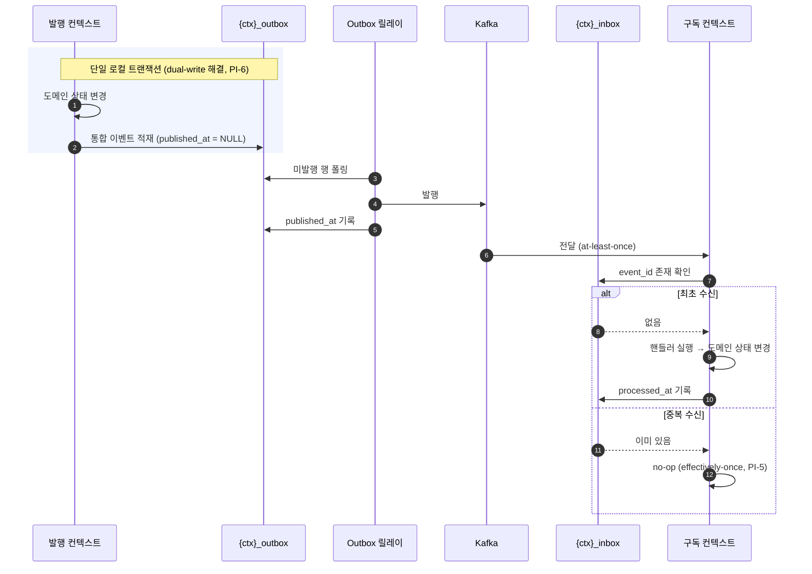
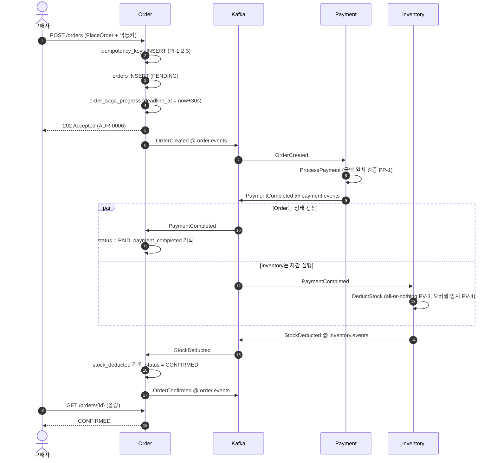
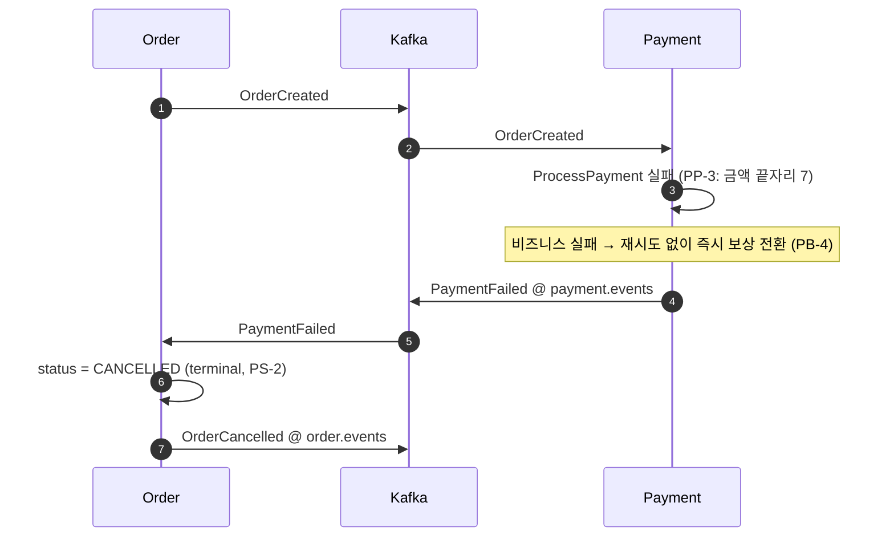
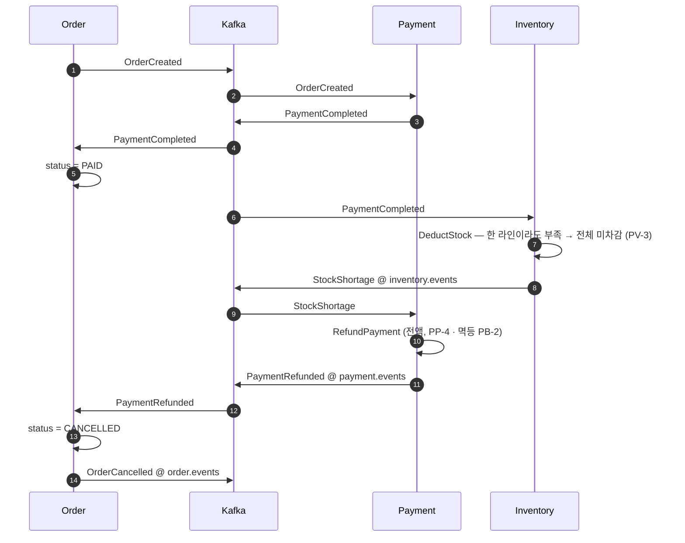
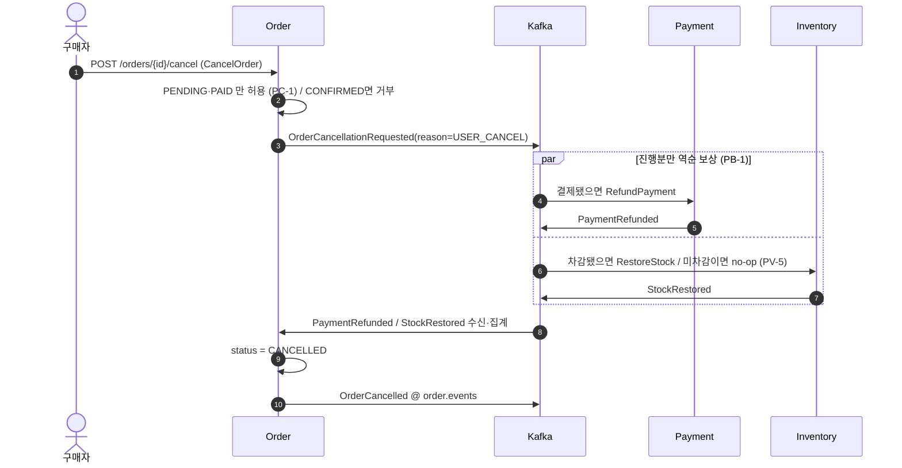
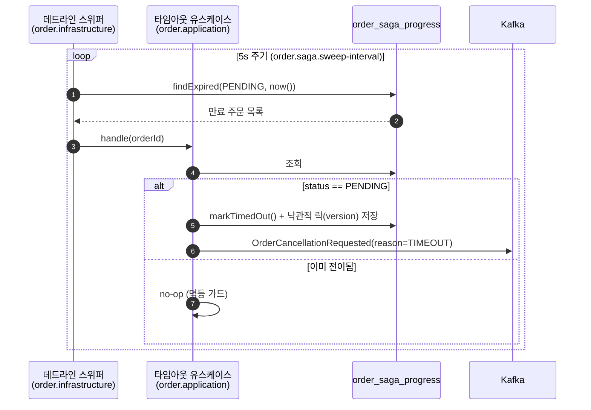

# event-flow — 컨텍스트 간 이벤트 흐름 (v1.0)

> **목적**: 컨텍스트 간 연결을 **메시지 흐름**으로 그린다. [erd.md](erd.md)는 테이블과 데이터 관계를 그리지만, 이 시스템은 C-2(Kafka 통합 이벤트 only)와 ADR-0004(스키마 분리)에 따라 **컨텍스트 간 데이터 관계를 의도적으로 제거**했다. 따라서 "order가 inventory를 어떻게 아는가"는 ERD가 아니라 이 문서가 답한다.
>
> **근거 문서**: [policy.md §1](policy.md)(이벤트 맵)·§4(PS 상태전이)·§8(PB 보상)·§9(PT 타임아웃), [ADR-0001](adr/0001-saga-orchestration-vs-choreography.md)(코레오그래피), [ADR-0003](adr/0003-order-deadline-checker.md)(데드라인·DLQ), [ADR-0004](adr/0004-schema-separation-outbox-readmodel.md)(Outbox/Inbox), [ADR-0007](adr/0007-integration-event-contract.md)(이벤트 계약).

---

## 1. 결합 구조 — 무엇이 무엇을 아는가

| 층위 | 연결 수단 | 근거 |
|------|-----------|------|
| 컴파일 | **없음** — `order`는 `payment`·`inventory`를 import 못 함 | C-1 |
| DB | **없음** — 스키마 분리 + 컨텍스트별 DataSource로 cross-schema 접근 물리적 불가 | ADR-0004 A-2·B-2 |
| 런타임 | **Kafka 통합 이벤트만** | C-2 |
| 계약 | `shared`의 payload record + `EventEnvelope<T>` | C-3, ADR-0007 §4 |
| 상관관계 | `orderId` — envelope 필드이자 **파티션 키** | PI-4, ADR-0007 §6 |

즉 컨텍스트를 잇는 것은 FK가 아니라 **`orderId`라는 상관관계 키**다. DB 제약이 아니라 애플리케이션 규약이므로, 정합성은 사가 흐름과 멱등성 정책이 지킨다.

### 토픽 (ADR-0007 §5)

`order.events` · `payment.events` · `inventory.events` — 컨텍스트별 3개. 구독자는 envelope의 `eventType`으로 분기한다.

> **순서 보장의 범위**: 같은 주문의 이벤트는 파티션 키가 `orderId`라 *한 토픽 내에서는* 순서가 보장된다. 그러나 한 주문의 이벤트는 3개 토픽에 흩어지므로 **토픽 간 전역 순서는 보장되지 않는다.** 이는 결함이 아니다 — 인과 순서는 사가 흐름 자체가 강제한다(Inventory는 `PaymentCompleted`를 받아야만 차감, PV-2).

---

## 2. 한 홉(hop)의 실제 구조

아래 시나리오 다이어그램은 가독성을 위해 컨텍스트 간 화살표를 한 줄로 그렸지만, **모든 홉은 실제로 Outbox → 릴레이 → Kafka → Inbox를 거친다**(PI-5·PI-6).

이 구조 덕분에 아래 시나리오들은 **모든 화살표가 중복 전달되어도 결과가 같다**(PS-4·PB-2·PT-3).

---

## 3. 정상 흐름 (Happy Path)

`PENDING → PAID → CONFIRMED` (PS-1)

**여기가 질문의 답**: Order가 재고 상황을 아는 유일한 지점은 `order_saga_progress.stock_deducted`이며, 이는 `inventory_schema.stocks`를 조회한 값이 **아니라** `StockDeducted`를 소비해 만든 **자기 사본**이다. ADR-0004 §6은 이를 "정규화 위반처럼 보이나 컨텍스트 자율성을 위한 의도적 중복"으로 명시한다.

> **재고 차감이 결제 이후인 이유**(PV-2): 결제 확정 후 차감해야 "결제는 됐는데 재고가 없는" E2가 발생하고, 그래야 *진짜 보상 트랜잭션*(환불)을 학습할 수 있다.

---

## 4. 실패 · 보상 흐름

보상은 **수행된 정방향 단계만 역순으로**(PB-1), 각 보상은 **멱등**(PB-2), **최종적으로 반드시 완료**(PB-3).

### E1 — 결제 실패 (보상 없음)

재고 차감 전이라 되돌릴 것이 없다.

### E2 — 결제 성공 후 재고 부족 (진짜 보상)

> 하류 실패(E1·E2)는 **실패 이벤트가 직접 보상을 트리거**하므로 `OrderCancellationRequested`를 쓰지 않는다(ADR-0007 §3 A-1).

### E6 — 사용자 취소 (`PAID` 상태) · Order 개시 보상

`OrderCancelled`는 보상이 *끝난 뒤* 나오는 terminal 이벤트라 트리거로 쓸 수 없다. 그래서 보상-개시 전용 이벤트 `OrderCancellationRequested(reason)`가 신설되었다(ADR-0007 §3 A-1).

> **PC-4 경합**: 취소 요청이 재고 차감과 경합하면(`PAID`↔`CONFIRMED` 전이 중) `order_saga_progress` 상태로 직렬화한다. 차감이 끝나 `CONFIRMED`가 되면 PC-1에 의해 취소가 거부된다. 취소와 확정은 동시에 성립할 수 없다.

### 타임아웃 — 데드라인 체커 (PT-1)

코레오그래피에는 중앙 오케스트레이터가 없으므로 **Order가 자기 사가의 마감을 스스로 감시**한다.

이후는 E6과 동일한 보상 경로로 흐른다(`reason`만 다름).

> **핵심 경합**: 스위퍼가 "만료"로 판단한 직후 `PaymentCompleted`가 도착할 수 있다. 정상 진행 핸들러와 타임아웃 핸들러가 같은 행을 두고 경쟁하며, 낙관적 락(`version`)으로 **둘 중 하나만 이기고** 진 쪽은 멱등 가드(`status != PENDING`)에서 no-op한다. 중앙 상태가 없어 Order가 자체 동시성을 정리해야 하는 것 — 코레오그래피의 대가다.

| 설정 | 키 | 기본값 |
|------|-----|--------|
| 전체 사가 데드라인 | `order.saga.deadline` | 30s |
| 스위퍼 주기 | `order.saga.sweep-interval` | 5s |

---

## 5. 실패의 두 부류 — 절대 섞지 않는다

ADR-0003 §5 C-1이 이 문서에서 가장 중요한 운영 규약이다.

| 부류 | 예 | 처리 | 종착지 |
|------|----|------|--------|
| **비즈니스 실패** | 재고부족(PV-3) · 결제거절(PP-3) | 재시도 ❌ → 즉시 실패 이벤트 발행 | **보상 흐름** (정상 사가 분기) |
| **일시적 인프라 오류** | DB 순단 · 네트워크 타임아웃 · 역직렬화 실패 | 지수 백오프 재시도 (1s→2s→4s, 최대 4회) | 초과 시 **DLQ** (`<topic>.DLT`) |

**구현 규약**: 비즈니스 실패는 **예외로 던지지 않고** 핸들러가 정상 리턴하며 실패 이벤트를 발행한다. 인프라 오류만 예외로 터뜨려 에러 핸들러에 태운다. 재고부족을 예외 → 재시도로 흘리면 *정상 결과가 장애처럼 DLQ를 오염*시킨다.

> DLQ는 유실이 아니다(PT-4). 보존 + 로그/경보 + 수동 재처리 경로를 둔다.

---

## 6. 이벤트 목록 요약

**발행/payload는 ADR-0007 §3 확정.** 구독자 열은 어느 ADR에도 표로 정의되어 있지 않아, policy.md §1 흐름도와 ADR-0007 §3 A-2 보상 흐름에서 **역추적한 것**이다(출처 열 참조). 구독 토폴로지를 정식 확정하려면 별도 결정이 필요하다(§7-3).

| 발행 | 이벤트 | payload | 구독 | 구독자 출처 |
|------|--------|---------|------|-------------|
| Order | `OrderCreated` | `buyerId`, `orderItems[]`, `totalAmount` | Payment | policy §1 정상 흐름 |
| Order | `OrderCancellationRequested` | `reason` (USER_CANCEL \| TIMEOUT) | Payment, Inventory | ADR-0007 §3 A-1 |
| Order | `OrderConfirmed` | — | (terminal 알림) | — |
| Order | `OrderCancelled` | `reason` | (terminal 알림) | — |
| Payment | `PaymentCompleted` | `paymentId`, `amount` | Order, Inventory | PV-2 / PS-3 |
| Payment | `PaymentFailed` | `reason` | Order | ADR-0007 §3 A-2 (E1) |
| Payment | `PaymentRefunded` | `paymentId`, `amount` | Order | ADR-0007 §3 A-2 (E2) |
| Inventory | `StockDeducted` | `orderItems[]` | Order | policy §1 정상 흐름 |
| Inventory | `StockShortage` | `shortageProductIds[]` | Payment | ADR-0007 §3 A-2 (E2) |
| Inventory | `StockRestored` | `orderItems[]` | Order | ADR-0007 §3 A-1 |

메타(`eventId`·`occurredAt`·`orderId`·`eventType`)는 payload가 아니라 `EventEnvelope<T>`에 있다(ADR-0007 §4).

> E2에서 `StockShortage`는 **Payment만** 구독한다. Order는 환불이 끝난 뒤 `PaymentRefunded`로 결과를 받는다(ADR-0007 §3 A-2의 사슬). Order가 `StockShortage`를 직접 구독하면 환불 완료 전에 `CANCELLED`로 갈 수 있어 PB-1(진행분 역순 보상)과 어긋난다.

---

## 7. 주의 · 미결

1. **`CANCELLING` 상태 불일치** — ADR-0003의 스위퍼 코드는 `PENDING → CANCELLING` 전이를 쓰는데, policy.md §4 PS-1의 상태 집합(`PENDING`/`PAID`/`CONFIRMED`/`CANCELLED`)에는 `CANCELLING`이 없다. 보상 진행 중 상태를 정식 도입할지 결정 필요.
2. **`PAID`에서 멈춘 사가의 타임아웃** — 스위퍼 스캔 조건이 `status = PENDING`이라, 결제는 끝났는데 `StockDeducted`가 영영 안 오는 주문은 만료 대상에서 빠진다. "전체 사가 타임아웃"이라는 ADR-0003 결정 A-1의 의도와 어긋나므로 스캔 조건 확대 여부 확인 필요.
3. **구독 토폴로지 미정 → Inbox 키도 미결** — 어느 컨텍스트가 어떤 이벤트를 구독하는지는 어느 ADR에도 표로 확정되어 있지 않다(§6의 구독 열은 흐름도에서 역추적한 것). ADR-0004 §7의 Inbox 키 결정은 이 토폴로지를 전제로 미뤄져 있는데, **아직 해소되지 않았다**: `PaymentCompleted`가 Order·Inventory 양쪽에 가지만 둘은 **다른 컨텍스트라 `order_inbox`/`inventory_inbox`라는 별개 테이블**에 쓰므로 충돌하지 않는다. 복합키가 필요해지는 조건은 ADR-0007 §9가 명시한 대로 "**한 컨텍스트가** 같은 이벤트를 여러 핸들러로 처리"하는 경우이며, 현재 흐름에는 그런 사례가 없다. 따라서 지금은 `event_id` 단독 PK로 충분하되, 토폴로지를 확정하면서 함께 재검토해야 한다.
4. **`OrderCancellationRequested` 보상 집계 종료 조건** — Order가 `PaymentRefunded`/`StockRestored`를 몇 개까지 기다렸다 `CANCELLED`로 갈지(진행분이 0개인 경우 포함)의 판정 규칙이 아직 문서에 없다.
